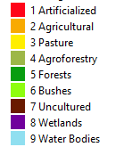

    
    <h4 align="center">Experimental automatic terrain classification plugin for Qgis  intended for land use and land cover applications.</h4>

     

# Auto_terrain_classification

The following experimental plugin was created in the sequence of a master thesis focused on the creation of an automatic land use and land cover classifier. The plugin employs the best performing machine learning algorithm (neural networks) among the tested approaches (Support vector machines, Random Forest, Neural networks), to predict 9 commonly used major classes (Artificialized, Agricultural, Pasture, Agroforestry, Forests, Bushes, Uncultured, Wetlands, Water Bodies) in a multi-temporal per-pixel approach.

## Quick Start
To install the plugin follow the next steps:

First we're going to need a working QGIS environment, along with GDAL.
* Download and install OSGeo4W from the [QGIS directory](https://qgis.org/en/site/forusers/download.html)

After the QGIS environment has been installed, we need to resolve the plugin dependencies.
The plugin utilizes, among other packages already present in the OSGeoShell, two external packages:
[Scikit-learn](https://scikit-learn.org/stable/), used in the machine learning processes;
[Sentinelsat](https://github.com/sentinelsat/sentinelsat), used in the retrieval of satellite imagery. 

In order to install both dependencies, follow the next steps:
* Run OSGeo4W Shell
* Type:
     * py3_env
     * pip install sklearn
     * pip install sentinelsat

Next we just need to install the plugin:
* Clone the plugin Repo as a zip
* Open QGIS app and follow the next steps:
    * Click on the **Plugins** tab and **Manage and Install Plugins...**
    * Click on **Install from ZIP** and select the downloaded repository folder.

Done, the plugin should now be installed and present in the **Plugins** tab.

## FAQ
I've initialized the plug-in before installing the required packages, got an error, and even after installing the required packages, the plugin still show the same error.
* This problem happens when the plugin has not been properly restarted, to fix the error:
    * Download the plugin "Plugin Reloader" from the QGIS **plugin** tab **Manage and Install Plugins...***
    * Select the ATC plugin in the **Configure** subtab, and reload the ATC plugin.

    

## User guide

The main focus of the plugin implementation was simplicity.
To operate it we need only to choose the intended area's coordinate system in the QGIS interface, and follow the instructions present in the plugin UI itself:

    

The final operation will reveal two images, the ground truth and the predicted image.
In this example:

    
    

With the following labels:

## Files to edit
The main files to edit, in which all the functioning parts are present, are:
* auto_terrain_classification.py
* auto_terrain_classification_crosshair.py

## Notice (Important)

At the moment, issues related with the sentinel database has prevented the acquisition of older tiles (roughly 8 months) necessary for the classification procedure. 

As it stands, the plugin will not function correctly. 

Waiting for sentinel infrastructure fix.

